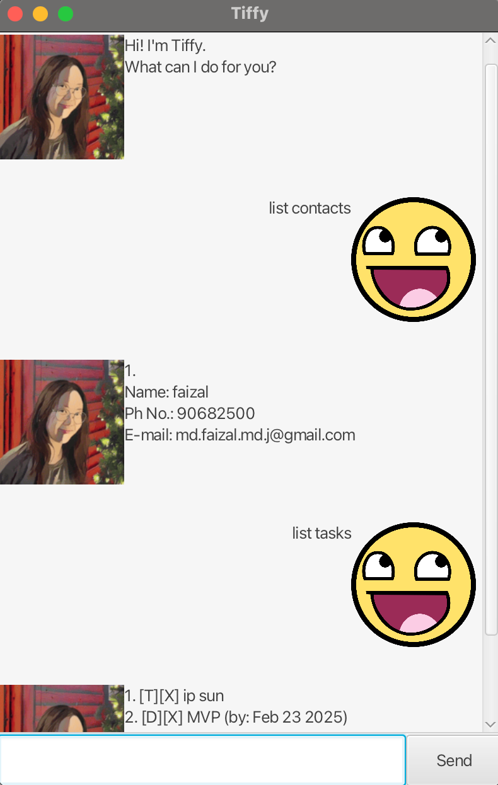

# Tiffy User Guide




Tiffy is a friendly chat bot that manages your tasks and contacts.


## Adding Todo Tasks
Users may keep track of their tasks by adding them.

Todo syntax:
`todo <description>`

Example:
`todo IP Submission`

```
Task added:
[T][ ] IP Submission
You have 1 tasks.
```

## Adding Event Tasks

Event syntax:  
`event <description> /from <YYYY-MM-DD> /to <YYYY-MM-DD>`

Example:
`event camp /from 2025-05-23 /to 2025-05-25`

```
Task added:
[E][ ] camp (from: May 23 2025 to: May 25 2025)
You have 2 tasks.
```

## Adding Deadline Tasks

Event syntax:
`deadline <description> /by <YYYY-MM-DD>`

Example:
`deadline homework /by 2025-02-23`

```
Task added:
[D][ ] homework (by: Feb 23 2025)
You have 3 tasks.
```

## Finding Tasks by Keyword(s)

Event syntax:
`find <keyword(s)>`

Example:
`find home`

```
Task(s) we found with your query:
1. [D][ ] homework (by: Feb 23 2025)
```

## Marking/Unmarking Tasks

Mark syntax:  
`mark <index>`  
`unmark <index>`

Example:  
`mark 1`  
`unmark 1`

Outputs:
```
Task marked as done:
[T][X] IP Submission

Task marked as undone:
[T][ ] IP Submission
```
```
Task already marked!
```
```
Invalid index!
```

## Adding Contacts

Event syntax:  
`contact /name <name> /num <phone number> /email <email>`  
`contact /name <name> /num <phone number>`

Example:
`contact /name faizal /num 90682500 /email md.faizal.md.j@gmail.com`
`contact /name ryan /num 82568210`

Outputs:
```
Contact has been added!
Name: faizal
Ph No.: 90682500
E-mail: md.faizal.md.j@gmail.com
```
```
Contact has been added!
Name: ryan
Ph No.: 82568210
E-mail: N/A
```

## Delete Task/Contact

Delete syntax:  
`delete <task> <index>`  
`delete <contact> <index>`

Example:  
`delete contact 1`  
`delete task 1`

Outputs:
```
Task deleted:
[T][X] IP Submission
You have 2 tasks.
```
```
Contact deleted:
Name: faizal
Ph No.: 90682500
E-mail: md.faizal.md.j@gmail.com
```

## List Task/Contact

List syntax:
`list <type>`

Example:  
`list tasks`  
`list contacts`

Invalid example:
`list task`

Outputs:
```
1. [E][ ] camp (from: May 23 2025 to: May 25 2025)
2. [D][ ] homework (by: Feb 23 2025)
```

```
1.
Name: ryan
Ph No.: 82568210
E-mail: N/A

2.
Name: ...
Ph No.: ...
E-mail: ...
```

## Save Data
Users may save their data for future reference.

Syntax: `bye`

Examples:  
`bye tiffy!`  
`bye lol`

Invalid examples:  
`byeeee`  
`Bye`

Outputs:
```
Goodbye!
```
